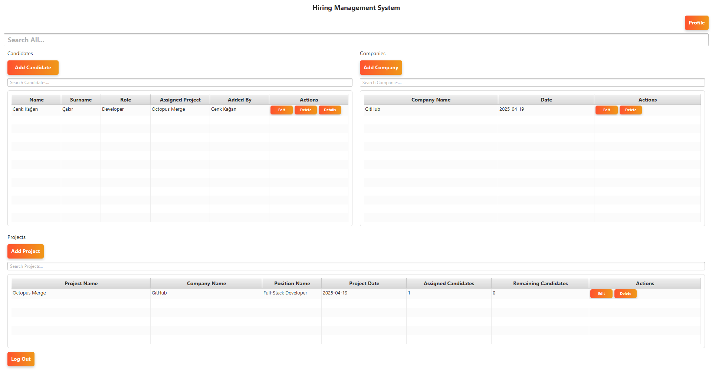
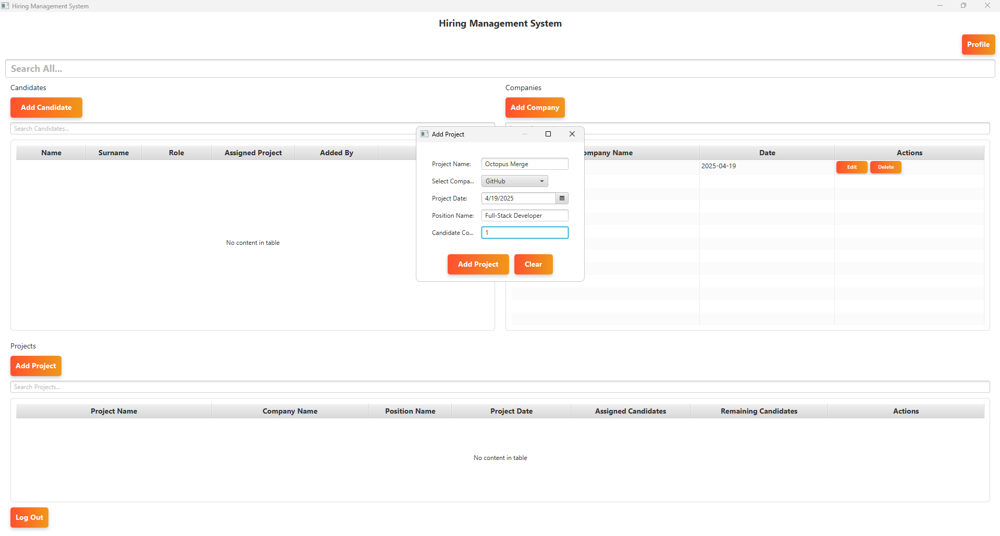
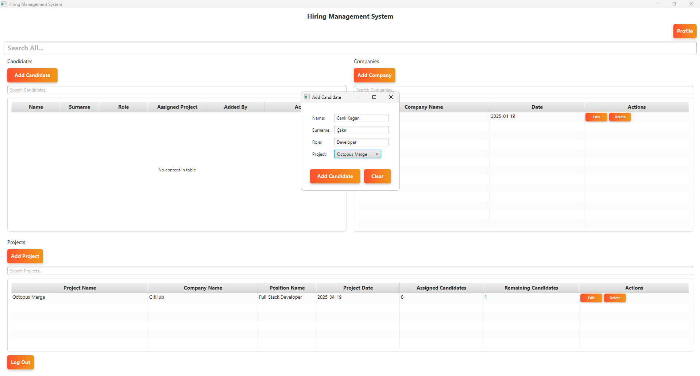
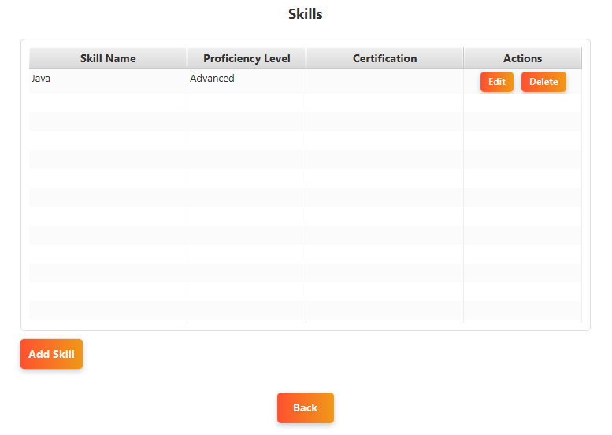

<h1 align="center">💼 Hiring Management System</h1>

<p align="center">
  A professional desktop application built with JavaFX for managing recruitment operations,<br>
  including companies, job projects, and candidates — with secure email-based notifications.
</p>

---

## 📸 Screenshots

| Dashboard | Add Project | Add Candidate |
|----------|-------------|----------------|
|  |  |  |

| Company Management | Skill Management |
|-------------------|------------------|
|  |  |

---

## 🚀 Features

- 🏢 Company, Project & Candidate management  
- 🔍 Real-time search and filtering  
- 💬 Candidate skill management  
- ✏️ Validation, update and delete functionality  
- 🔐 Simple login & profile management  
- 📧 Email notifications via JavaMail (password reset etc.)  
- 🧠 Built with JavaFX (JDK 21), MSSQL & Scene Builder  

---

## 🔧 Technologies Used

- ☕ Java 21  
- 🎨 JavaFX 23  
- 🖌️ Scene Builder  
- 🛢️ Microsoft SQL Server  
- 📡 JDBC  
- 📬 JavaMail (secured via dotenv)  
- 🛠️ IntelliJ IDEA  

---

## 🛠️ Setup Instructions

1. **Clone the repository:**
```bash
git clone https://github.com/Speellz/HiringManagementSystem.git
cd HiringManagementSystem
```

2. **Add your email credentials in `.env` file (not included in repo):**
```
EMAIL_ADDRESS=your@email.com
EMAIL_PASSWORD=your_app_password
```

3. **Add DLL path (if using integrated security):**
```cmd
set DLL_PATH=C:\dll\mssql-jdbc_auth-12.8.1.x64.dll
```

4. **Configure JavaFX VM options (in IntelliJ Run Configurations):**
```bash
--module-path "C:\javafx-sdk-23\lib" --add-modules javafx.controls,javafx.fxml
```

5. **Run the project!**  
Make sure your MSSQL database is running and your credentials match.

---

## 📁 Project Structure

```
HiringManagementSystem/
├── src/
│   ├── main/
│   │   └── java/
│   │       └── com/BRJavaProject/
│   │           ├── ui/
│   │           ├── model/
│   │           ├── utils/
│   │           └── database/
├── screenshots/
├── .env.example
├── .gitignore
└── README.md
```

---

## 👤 Developer

**Cenk Kağan Çakır**  
[GitHub: Speellz](https://github.com/Speellz)  
[LinkedIn: Cenk Kağan Çakır](https://www.linkedin.com/in/cenkkaancakir)

> Full-stack thinking, clean structure, smart solutions.  
> Built to work, styled to impress. ☕💻
